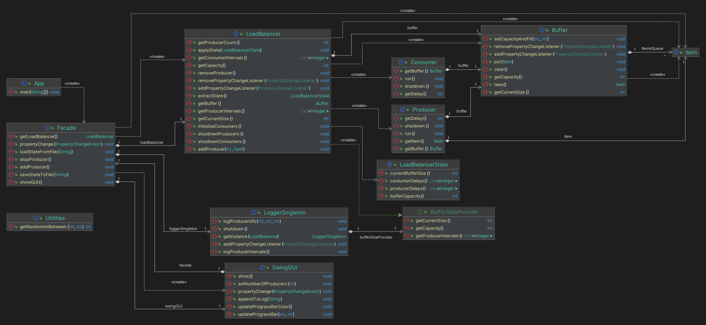

# Load Balancer Simulation

This Java application simulates a load balancing system, where producers generate items and consumers process them. The system uses a buffer to manage the flow of items, ensuring that producers and consumers operate at an efficient pace without overloading the system.

## Features

- **Producers and Consumers**: The application models producers that create items and consumers that process them.
- **Buffer**: A thread-safe buffer that temporarily stores items produced, ensuring a smooth transfer between producers and consumers.
- **Load Balancing**: The system includes a load balancer that manages the distribution of items to consumers based on their availability.
- **GUI**: A Swing-based graphical user interface that allows users to interact with the simulation in real-time.
- **Logging**: A singleton logger that tracks and logs significant events within the system.
- **State Management**: The application can save and load the state of the load balancer, allowing for persistent simulations.

## Structure

- [`App.java`](https://github.com/preaker81/JAVA22-java2-slutprojekt-jimmy-karlsson/blob/main/src/main/java/com/slutprojekt/JimmyKarlsson/App.java): The entry point of the application, which sets up the system and starts the GUI.
- [`Facade.java`](https://github.com/preaker81/JAVA22-java2-slutprojekt-jimmy-karlsson/blob/main/src/main/java/com/slutprojekt/JimmyKarlsson/controller/Facade.java): Acts as a controller, managing the interaction between the model and the view.
- [`Buffer.java`](https://github.com/preaker81/JAVA22-java2-slutprojekt-jimmy-karlsson/blob/main/src/main/java/com/slutprojekt/JimmyKarlsson/model/Buffer.java): A thread-safe class that handles the storage and transfer of items.
- [`Consumer.java`](https://github.com/preaker81/JAVA22-java2-slutprojekt-jimmy-karlsson/blob/main/src/main/java/com/slutprojekt/JimmyKarlsson/model/Consumer.java): Represents a consumer that processes items from the buffer.
- [`Item.java`](https://github.com/preaker81/JAVA22-java2-slutprojekt-jimmy-karlsson/blob/main/src/main/java/com/slutprojekt/JimmyKarlsson/model/Item.java): A placeholder class representing an item in the producer-consumer context.
- [`LoadBalancerState.java`](https://github.com/preaker81/JAVA22-java2-slutprojekt-jimmy-karlsson/blob/main/src/main/java/com/slutprojekt/JimmyKarlsson/model/LoadBalancerState.java): A serializable state of the load balancer for saving/loading purposes.
- [`BufferSizeProvider.java`](https://github.com/preaker81/JAVA22-java2-slutprojekt-jimmy-karlsson/blob/main/src/main/java/com/slutprojekt/JimmyKarlsson/model/interfaces/BufferSizeProvider.java): An interface defining methods for providing buffer size information.
- [`LoggerSingleton.java`](https://github.com/preaker81/JAVA22-java2-slutprojekt-jimmy-karlsson/blob/main/src/main/java/com/slutprojekt/JimmyKarlsson/utils/LoggerSingleton.java): A singleton class for logging system events.
- [`Utilities.java`](https://github.com/preaker81/JAVA22-java2-slutprojekt-jimmy-karlsson/blob/main/src/main/java/com/slutprojekt/JimmyKarlsson/utils/Utilities.java): Contains utility functions used throughout the application.
- [`SwingGUI.java`](https://github.com/preaker81/JAVA22-java2-slutprojekt-jimmy-karlsson/blob/main/src/main/java/com/slutprojekt/JimmyKarlsson/view/SwingGUI.java): The class responsible for creating and updating the user interface.

## Usage

To run the simulation, simply execute the `App.java` file. The GUI will start, and you can interact with the system through it.
